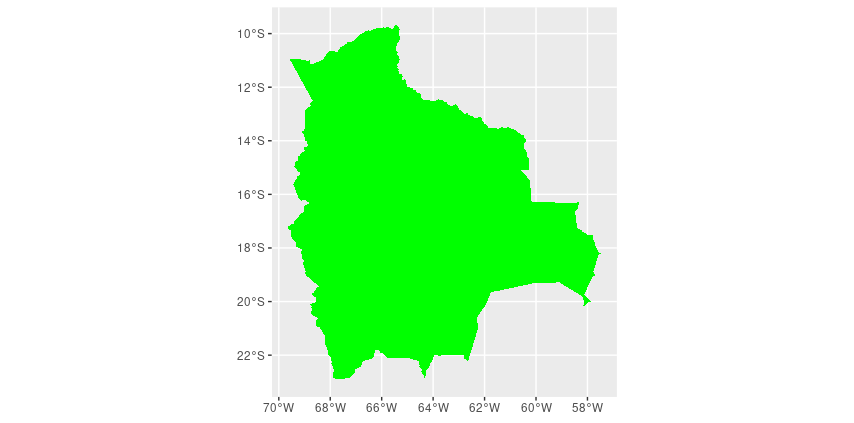
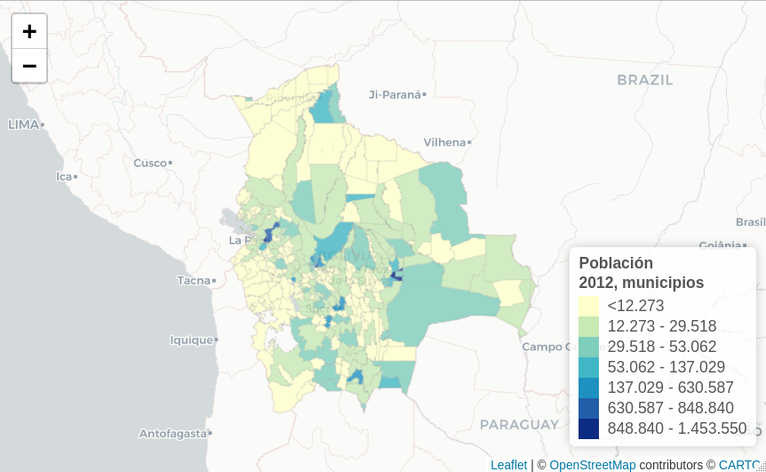

# R_geom

Explorando el uso de datos geoespaciales en el entorno R

---

## 📊 Contenido

**GEOPROCESAMIENTO**

[Acceso a datos Natural Earth](geodatos/README.md)  |  

[Introducción a geoparquet](01/geoparquet_intro.R)

[Lectura y visualización de archivos GPX](03/leer_gpx.R)

[Recortar datos ráster](04/recortar_datos_raster.R)

[Demostración de trabajo con datos netCDF ](07/netcdf_in_r.R)

[Calcular extensión de categorías de valores ráster](08/calc_area_categorias.R)

**CARTOGRAFÍA & VISUALIZACIÓN**

[Mapa interactivo de municipios](leaflet/README.md)  |  

[Efectos de relieve sombreado, ejemplo dptos Bolivia](02/Bol_hillshade_effects.R)

[Visualización de geodatos Natural Earth](05/natural%20earth%20-%20Bolivia.R)

[Haz tu primer mapa interactivo](06/primer_mapa_interactivo.R)

**AVANZADO**

